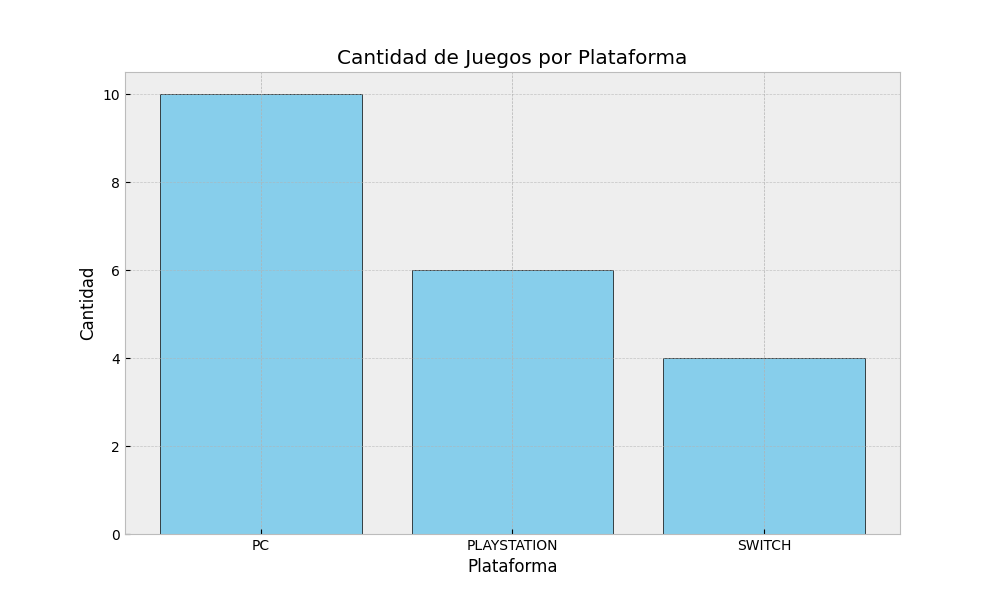
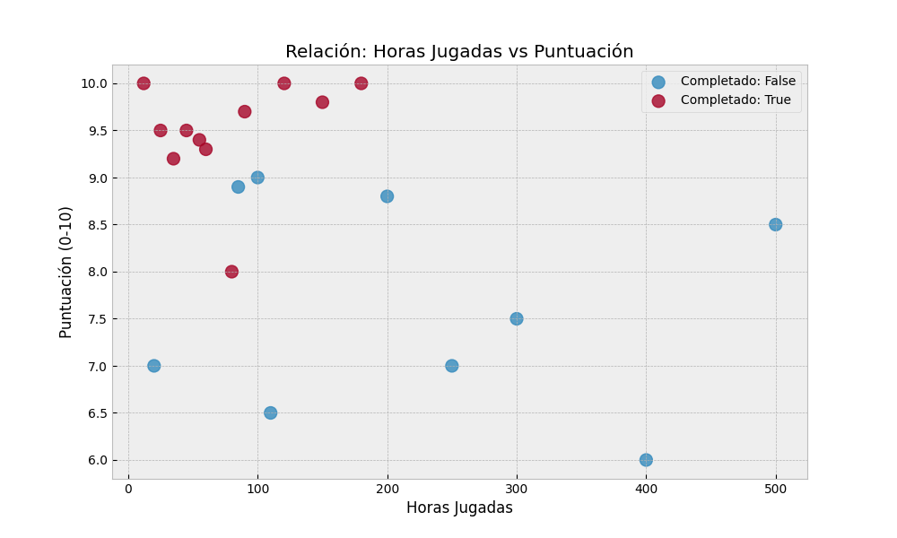

# P04 - Análisis de Datos Personales: Videojuegos

## 1. Introducción
En mi caso, he elegido el proyecto con datos de videojuegos, para el proyecto he usado funciones que incluyen Pandas y Matplotlib para analizar mi historial de videojuegos con el objetivo de descubrir los patrones de juego en mis hábitos. Ya sea ver que juego más o qué plataforma es la que más uso

## 2. Metodología
* **Dataset:** He creado un dataset (`dataset.csv`) con 20 registros de videojuegos que conozco y he jugado.
* **Columnas:** He incluido el título, plataforma, género, año, horas jugadas, puntuación, etc.
* **Herramientas:** He usado Python, Pandas para manipulación de datos y Matplotlib para ver y generar gráficos.

## 3. Limpieza de Datos
* Cargué el CSV correctamente en el código
* Pasé todos los nombres a mayúsculas para tenerlos normalizados y ser más fácil de leer y de manipular
* Mediante código he incluido una forma de ver si existen valores nulos o duplicados

## 4. Visualizaciones

### Gráfico 1: Distribución por Plataforma

*Interpretación:* Se puede ver que mi plataforma con más cantidad de juegos es en PC.

### Gráfico 2: Relación Horas vs. Puntuación

*Interpretación:* Aquí puedo ver que paso más horas en juegos competitivos por ejemplo, aunque no tienen la puntuación más alta

## 5. Conclusiones
1.  Mis géneros favoritos son Puzzle, Aventura y Metroidvanias
2.  La correlación entre horas invertidas y satisfacción es algo que me esperaba distinto ya que juegos a los que le dedico más horas suelen tener puntuaciones más bajas y juegos que son más cortos tienen mayores puntuaciones
3.  He aprendido a usar más gráficos y configurar los mismos con matplotlib 